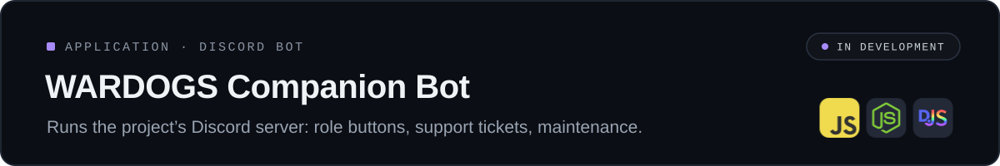
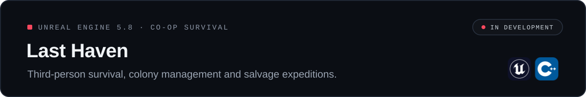
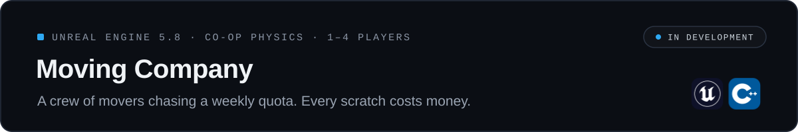

  <a href="#experience"><b>Experience</b></a> ·
  <a href="#applications"><b>Applications</b></a> ·
  <a href="#websites"><b>Websites</b></a> ·
  <a href="#unreal-engine-projects"><b>Unreal Engine projects</b></a> ·
  <a href="#tech-stack"><b>Tech stack</b></a> ·
  <a href="#contact"><b>Contact</b></a>

Hi, I'm Biggy, a developer who enjoys building things people actually use. I make applications, websites and games, from Twitch extensions and Discord bots to C++ on Unreal Engine 5. I'm persistent and I love what I do: when a project is viable and worth it, I see it through to the end.

## Experience

  
  
  &nbsp;&nbsp;

## Applications

  
  
  &nbsp;&nbsp;

  
  

## Websites

  
  
  &nbsp;&nbsp;

  
  

## Unreal Engine projects

  

  

## Tech stack

#### Game development

#### Web

#### Back end & database

#### Tools & platforms

  
  
  

## Contact

  

