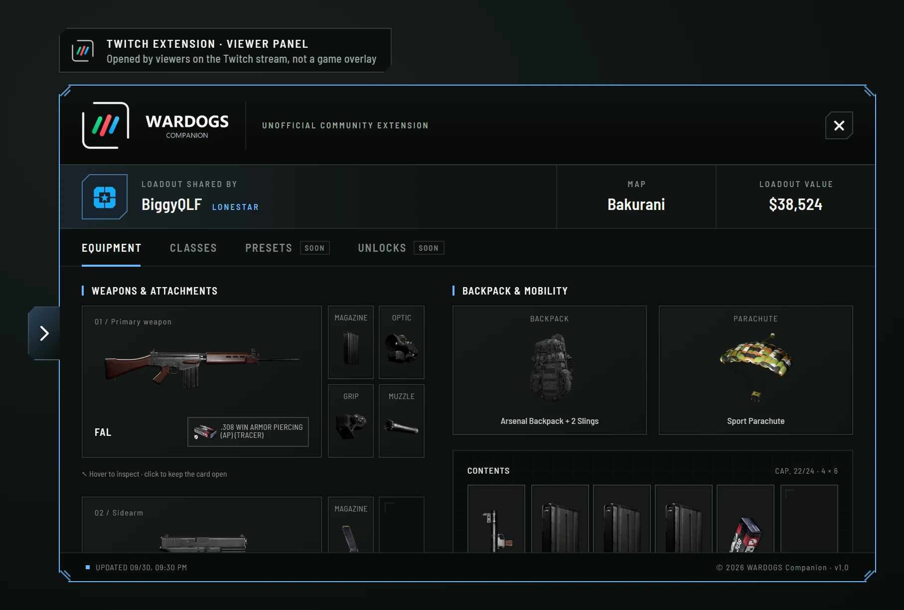
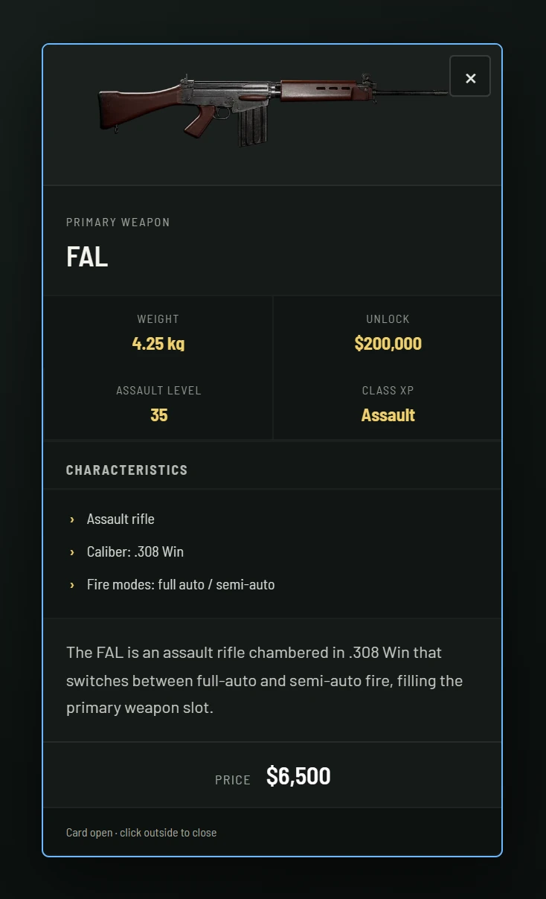
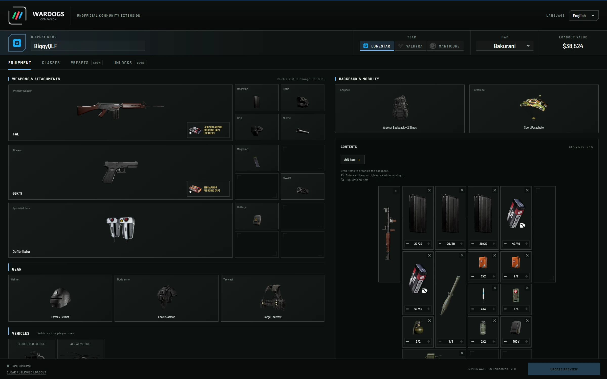

  <a href="#applications"><b>Applications</b></a> ·
  <a href="#websites"><b>Websites</b></a> ·
  <a href="#unreal-engine-projects"><b>Unreal Engine projects</b></a> ·
  <a href="#experience"><b>Experience</b></a> ·
  <a href="#tech-stack"><b>Tech stack</b></a>

Hi, I'm Biggy. I build applications and websites, and I'm working on two co-op games on Unreal Engine 5. My main project is **WARDOGS Companion**, a Twitch extension for WARDOGS players and streamers, with its own website and Discord bot.

## Applications

### Featured: WARDOGS Companion

**Your WARDOGS loadout, live on stream.** An unofficial community Twitch extension that shows a streamer's full WARDOGS loadout in a panel over the video, item by item, with the prices, sizes and weights the game uses. The streamer builds it once in a live editor; viewers open it whenever they want, without asking in chat.

**Video overlay** · **Live streamer editor** · **273 items** · **English and French** · **No server**

  
  

  

  

### Other applications

## Websites

## Unreal Engine projects

## Experience

## Tech stack

#### Game development

#### Web

#### Back end & database

#### Tools & platforms

  
  
  

<!--
## Contact
[Twitch](https://www.twitch.tv/TON_PSEUDO) · [LinkedIn](https://www.linkedin.com/in/TON_PROFIL/)
-->
