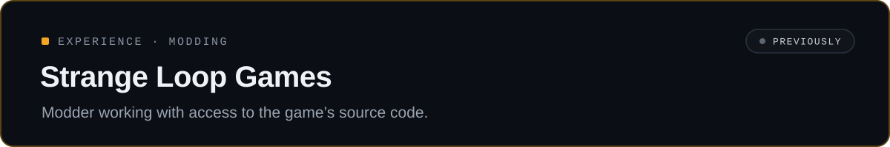
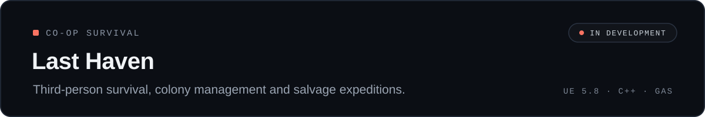
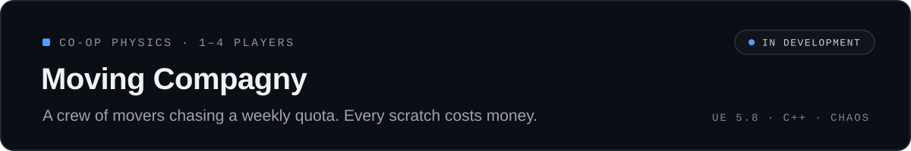
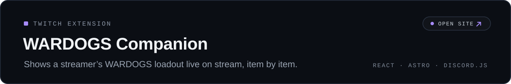
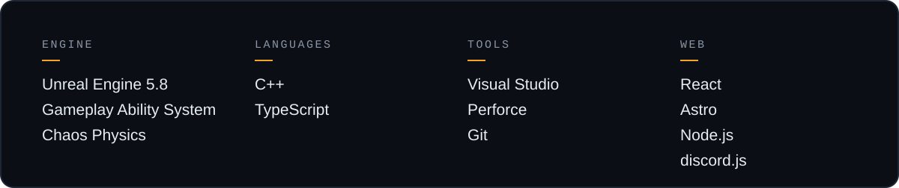

Hi, I'm Mathieu. I write gameplay and systems code in C++ on Unreal Engine 5, mostly for co-op multiplayer games. On the side, I build tools for players and streamers.

### Experience

### Currently building

### Stack

<!--
### Contact
[Twitch](https://www.twitch.tv/TON_PSEUDO) · [LinkedIn](https://www.linkedin.com/in/TON_PROFIL/)
-->
