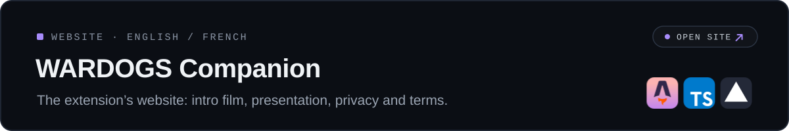
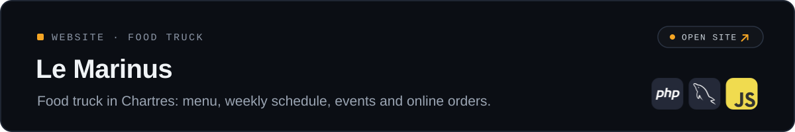
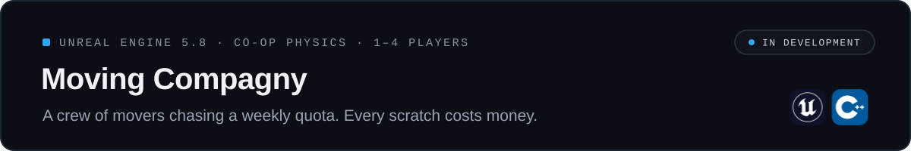

  <a href="#experience"><b>Experience</b></a> ·
  <a href="#applications"><b>Applications</b></a> ·
  <a href="#websites"><b>Websites</b></a> ·
  <a href="#unreal-engine-projects"><b>Unreal Engine projects</b></a> ·
  <a href="#tech-stack"><b>Tech stack</b></a>

Hi, I'm Biggy, a developer who enjoys building things people actually use. I make applications, websites and games, from Twitch extensions and Discord bots to C++ on Unreal Engine 5. I'm persistent, I love what I do, and I see my projects through to the end.

## Experience

## Applications

## Websites

## Unreal Engine projects

## Tech stack

#### Game development

#### Web

#### Back end & database

#### Tools & platforms

  
  
  

<!--
## Contact
[Twitch](https://www.twitch.tv/TON_PSEUDO) · [LinkedIn](https://www.linkedin.com/in/TON_PROFIL/)
-->
